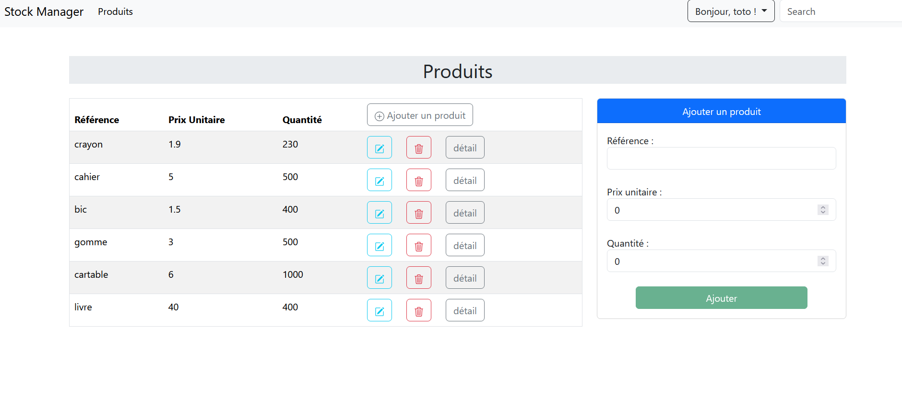

# Frontend (Angular) - StockManager

## Description

This is the Frontend part of the StockManager application, built using Angular. 
It allows users to interact with the backend to manage products in the inventory. 
The application provides a user-friendly interface to display the list of products, show product details, update product information,  and delete products 

## Configuration

API Base URL: The frontend communicates with the backend (Spring Boot API) at the URL http://localhost:8085. Make sure the backend is running on that URL. 
You can configure API endpoints in the : **/src/app/core/config/api.url.config.ts**

## Clone the repository

git clone https://github.com/lekond77/stockManagerFront.git

Appi repository available here : https://github.com/lekond77/stockManagerBack

## Description

Ceci est la partie Frontend de l'application StockManager, réalisée avec Angular.
Elle permet aux utilisateurs d'interagir avec le backend pour gérer les produits dans l'inventaire.
L'application fournit une interface conviviale pour afficher la liste des produits, afficher les détails d'un produit, mettre à jour les informations d'un produit et supprimer des produits.

## Configuration
URL de base de l'API : Le frontend communique avec le backend (API Spring Boot) à l'URL http://localhost:8085.
Assurez-vous que le backend est bien en cours d'exécution à cette URL.
Vous pouvez configurer les endpoints de l'API dans le fichier : /src/app/core/config/api.url.config.ts

## Cloner le dépôt
git clone https://github.com/lekond77/stockManagerFront.git

Le dépôt de l'API est disponible ici : https://github.com/lekond77/stockManagerBack

